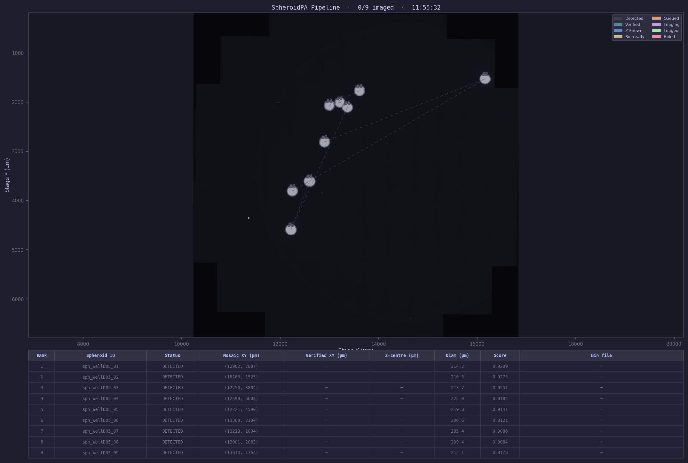
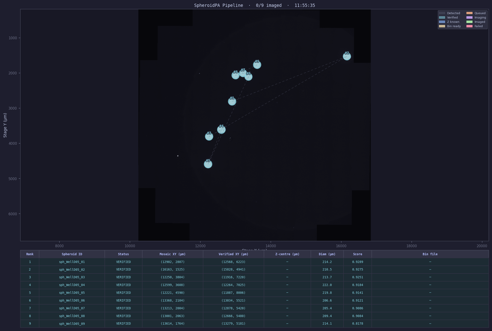
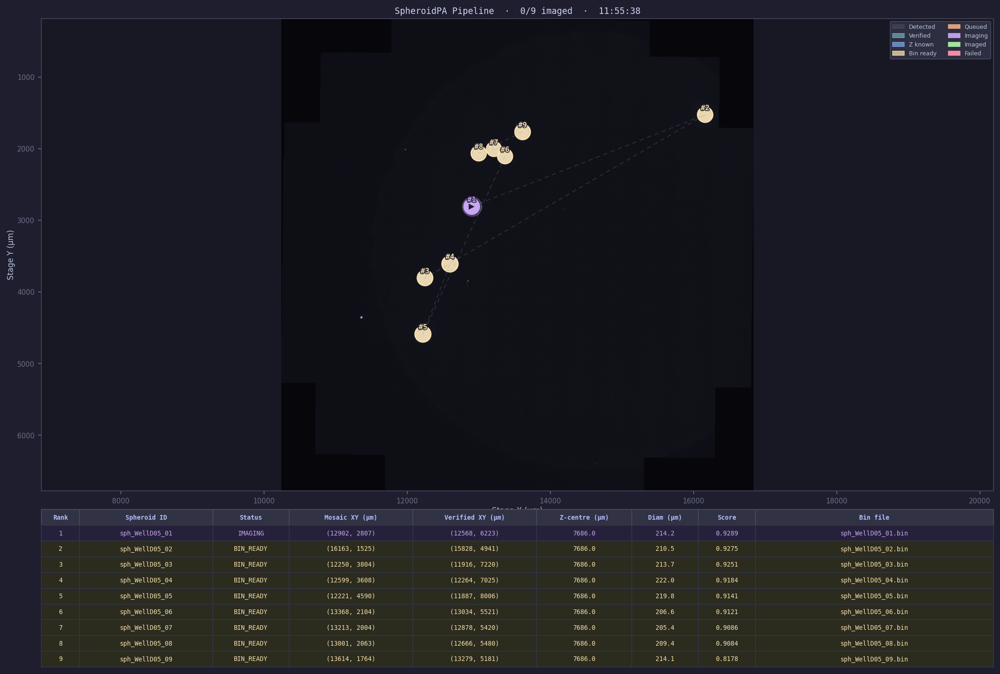
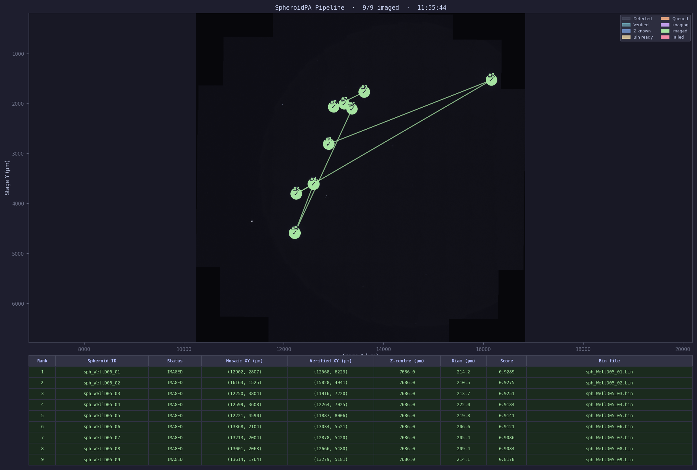

# SpheroidPA — Spheroid Screening & Cross-Zoom Pipeline

Automated pipeline for detecting, ranking, and imaging spheroids across 10X and 20X zoom levels in NIS-Elements. Covers the full workflow from mosaic screening to per-spheroid Beer-Lambert Z-intensity correction bin generation and NIS-E file-flag triggered capture.

---

## Pipeline Overview

```
10X mosaic nd2
    └─ spheroid_screener.py       → ranked CSV + SpheroidRecord list
         └─ cross_zoom_v2.py      → NCC offset (sub-10X nd2 → mosaic frame)
              └─ 20X autofocus nd2 → Z-centre per spheroid
                   └─ csv_to_nis_bin.py → per-spheroid .bin
                        └─ nis_macro_auto_capture.mac → NIS-E file-flag capture
```

---

## File Index

| File | Role |
|---|---|
| `spheroid_screener.py` | Detect & rank spheroids in 10X mosaic nd2 (watershed, size filter) |
| `cross_zoom_v2.py` | Sub-10X NCC matching → stage offset between mosaic and sub-10X frames |
| `spheroid_pipeline.py` | **Main state machine**: orchestrates all steps, holds `SpheroidRecord`, `PipelineDashboard` |
| `spheroid_pa_gui.py` | Tkinter GUI with 4-step Cross-Zoom Pipeline tab + existing tools |
| `csv_to_nis_bin.py` | Encode Beer-Lambert Z-intensity ramp → NIS-E `.bin` format |
| `nis_bin_to_csv.py` | Decode `.bin` → CSV (round-trip validation) |
| `nis_macro_auto_capture.mac` | NIS-E macro: polls file-flag, loads `.bin`, captures Z-stack per spheroid |
| `dry_run_pipeline.py` | Offline test: Steps 1-4 without NIS-E (uses local demo data) |
| `dry_run_dashboard.py` | Saves dashboard PNGs across all pipeline stages for visual verification |

---

## Key Constants & Parameters

| Parameter | Value | Notes |
|---|---|---|
| 10X pixel size | 0.644 µm/px | mosaic |
| 20X pixel size | 0.321 µm/px | scale factor ~0.499 |
| Stage offset (SLIM050) | dx ≈ −335 µm, dy ≈ +3415 µm | mosaic → sub-10X frame |
| NCC accept threshold | 0.40 | `NCC_MIN_ACCEPT` in pipeline |
| Anchor strategy | best-NCC-only | single highest match per sub-10X nd2 |
| Z half-range default | 18 µm | |
| Z step default | 2 µm | gives exactly 19 items (ROOT_TAIL_U64S constraint) |
| Beer-Lambert L | 165 µm | scattering length, user-adjustable |
| Trigger filename | `spheroid_trigger.ini` | INI key=value, polled by macro |
| Done filename | `spheroid_done.ini` | written by macro when capture completes |

---

## SpheroidRecord Status States

```
DETECTED → VERIFIED → Z_KNOWN → BIN_READY → QUEUED → IMAGING → IMAGED
                                                              ↘ FAILED
```

Dashboard circles fill from 25% alpha (DETECTED) to 100% (IMAGED/FAILED).

---

## GUI Walkthrough

Launch the GUI with:

```bash
python spheroid_pa_gui.py
```

Select the **Cross-Zoom Pipeline** tab. The tab is divided into four sequential steps.

---

### Step 1 — Screen 10X Mosaic

**What to fill in:**
- `Mosaic nd2` — path to the whole-well 10X mosaic `.nd2` acquired in NIS-E
- `Well ID` — label used in spheroid IDs (e.g. `WellD05`)
- `Output dir` — folder where all pipeline output will be written

**Click:** `Run Screener`

**What happens:** `spheroid_screener.py` runs watershed segmentation on the mosaic, ranks spheroids by size and roundness, and writes `pipeline_state.csv`. The ranked list populates the table below the controls.

**Expected output:**
```
Detected 9 spheroids (205-222 um diameter)
  Rank  1  sph_WellD05_01  diam=222.4 um  score=0.9585
  Rank  2  sph_WellD05_02  diam=217.6 um  score=0.9472
  ...
  Rank  9  sph_WellD05_09  diam=205.1 um  score=0.9111
```

**Dashboard at this stage** — all 9 circles at 25% opacity over the mosaic:



---

### Step 2 — Estimate Stage Offset (Sub-10X Anchor)

**In NIS-E first:** navigate to any 1–2 spheroids at 10X, capture a single-position ND acquisition, save as `.nd2`.

**What to fill in:**
- `Sub-10X nd2` — path to the sub-10X capture just saved

**Click:** `Estimate Offset`

**What happens:** `cross_zoom_v2.py` does NCC patch matching between the sub-10X image and the corresponding mosaic region. The best-NCC match determines the translation (dx, dy) between the two stage encoder frames. The offset is applied to all records, advancing their status to `VERIFIED`.

**Expected output:**
```
NCC=0.9910  dx=-334.6 um  dy=+3416.2 um
Offset applied to all 9 records.
```

Verify that dx/dy are plausible for your microscope (SLIM050 ground truth: ~−335, ~+3415 µm). If the values are wildly different, re-capture the anchor with the spheroid more centred in frame (avoid placing it within ~100 px of the image edge).

**Dashboard at this stage** — circles shift to 50% opacity, all `VERIFIED`:



---

### Step 3 — Record Z-Centre (20X Autofocus)

**In NIS-E:** switch to 20X, navigate to the verified XY shown in the table for each spheroid, run autofocus, and capture a single-frame nd2 (just to embed the Z encoder value in metadata).

**What to fill in (per spheroid):**
- Select rank from the dropdown
- `20X nd2` — path to the autofocus nd2 for that spheroid
- `Z half-range (um)` — default 18 µm (gives 19 Z-steps, required by bin format)
- `Z step (um)` — default 2 µm

**Click:** `Record Z` for each spheroid

**What happens:** Python reads `ND.ZPosition` from the nd2 metadata and stores it as `z_centre_um`. Status advances to `Z_KNOWN`.

**Expected output (rank 9):**
```
Rank 9: z_centre=7686.00 um  z_range=[7668.00, 7704.00]  status=Z_KNOWN
```

Repeat for all spheroids. The table updates live; circles brighten to 65% opacity as each Z is recorded.

---

### Step 4 — Generate Bins & Start Capture Queue

**What to fill in:**
- `P0 (%)` — starting laser power at top of spheroid (e.g. `15.0`)
- `L (um)` — Beer-Lambert scattering length (e.g. `165.0`)
- `Channel field` — NIS-E field name for laser power (e.g. `CH1LaserPower`)
- `Trigger dir` — directory the macro polls for trigger files (must match the path in `nis_macro_auto_capture.mac`)
- `nd2 output dir` — where NIS-E should save the captured Z-stacks

**In NIS-E:** open `nis_macro_auto_capture.mac` and click Run — it enters a polling loop.

**Click:** `Generate Bins + Start Queue`

**What happens:**
1. For each spheroid, `csv_to_nis_bin.py` builds a 19-point Beer-Lambert ramp and writes `sph_<well>_<rank>.bin`.
2. Python writes `spheroid_trigger.ini` for the first spheroid (status → `QUEUED`).
3. Macro detects the trigger, loads the `.bin`, captures the Z-stack, writes `spheroid_done.ini`.
4. Python reads `done`, advances status to `IMAGED`, writes the next trigger.
5. Repeats until all spheroids are done.

**Dashboard during imaging** — circles fill in one by one as each spheroid completes:



**Bin CSV preview (rank 9, P0=15%, L=165 µm):**

```
item,Z [um],LP1 (%)
0,7668.00,15.0
1,7670.00,15.2
...
9,7686.00,16.7   ← equatorial plane
...
18,7704.00,18.7
```

**Dashboard when complete** — all circles solid green, capture path drawn:



---

## Dry Run Step-by-Step

Run the full pipeline offline (no NIS-E) with:

```bash
python dry_run_pipeline.py
```

**Step 1 output — screener:**
```
============================================================
STEP 1: Screen 10X mosaic
============================================================
  Detected 9 spheroid(s):
    Rank  1  id=sph_WellD05_01  diam=222.4 um  score=0.9585  status=DETECTED
    Rank  2  id=sph_WellD05_02  diam=217.6 um  score=0.9472  status=DETECTED
    Rank  3  id=sph_WellD05_03  diam=214.0 um  score=0.9531  status=DETECTED
    Rank  4  id=sph_WellD05_04  diam=213.7 um  score=0.9324  status=DETECTED
    Rank  5  id=sph_WellD05_05  diam=212.7 um  score=0.9509  status=DETECTED
    Rank  6  id=sph_WellD05_06  diam=211.0 um  score=0.9419  status=DETECTED
    Rank  7  id=sph_WellD05_07  diam=210.0 um  score=0.9600  status=DETECTED
    Rank  8  id=sph_WellD05_08  diam=207.9 um  score=0.9440  status=DETECTED
    Rank  9  id=sph_WellD05_09  diam=205.1 um  score=0.9111  status=DETECTED
```

**Step 2 output — NCC offset:**
```
============================================================
STEP 2: Anchor offset estimation
============================================================
  Selected anchors: ranks [1, 7]
  Running NCC verification with sub-10X: spheroid 1 10x 1P 555nm.nd2
  NCC=0.9910  dx=-334.6 um  dy=+3416.2 um
  Offset applied to all 9 records.

  Records after offset:
    Rank  1  verified=(-12902.4, 3599.7) um  status=VERIFIED
    Rank  2  verified=(-12992.6, 4210.7) um  status=VERIFIED
    ...
    Rank  9  verified=(-13019.4, 3987.3) um  status=VERIFIED
```

**Step 3 output — Z from 20X nd2:**
```
============================================================
STEP 3: Record Z-centre from 20X autofocus nd2
============================================================
  Reading Z from 20x spheroid 1 1P 555nm.nd2 for rank 9 ...
  Rank 9: z_centre=7686.00 um  z_range=[7668.00, 7704.00]  status=Z_KNOWN
```

**Step 4a output — bin generation:**
```
============================================================
STEP 4a: Generate .bin for Rank 9
============================================================
  Bin written: demo_data/pipeline_dryrun/bins/sph_WellD05_09.bin
  Size: 27524 bytes
  Status: BIN_READY
```

**Step 4b output — trigger file (offline, no macro):**
```
============================================================
STEP 4b: Write trigger.ini (offline -- no NIS-E)
============================================================
  Trigger written: demo_data/pipeline_dryrun/trigger/spheroid_trigger.ini

  [spheroid]
  spheroid_id=sph_WellD05_09
  bin_path=...bins\sph_WellD05_09.bin
  nd2_out_path=...nd2_out\sph_WellD05_09.nd2
  z_start_um=7668.00
  z_end_um=7704.00
  z_step_um=2.00

  Status: QUEUED
```

**To visualise all stages**, run:

```bash
python dry_run_dashboard.py
```

This saves 15 PNGs to `demo_data/pipeline_dryrun/dash_*.png` stepping through every status transition.

**Bin content (rank 9):**

| Item | Z (µm) | LP1 (%) |
|---|---|---|
| 0 | 7668.00 | 15.0 |
| 4 | 7676.00 | 15.7 |
| 9 | 7686.00 | 16.7 |
| 14 | 7696.00 | 17.8 |
| 18 | 7704.00 | 18.7 |

19 items, 27 524 bytes. Beer-Lambert ramp with P0=15%, L=165 µm.

---

## Operator Workflow (NIS-E Hardware)

### One-time setup
1. Copy `nis_macro_auto_capture.mac` into the NIS-E macros directory.
2. Verify `ZIntCorrect_LoadFile()` is callable for your NIS-E version (test in macro editor).
3. Set trigger directory to the same path in both the GUI and the macro.

### Per-well run

**Step 1 — 10X mosaic (NIS-E then Python)**
- Acquire whole-well mosaic at 10X, save as `.nd2`.
- GUI Step 1: point at nd2, run screener → ranked list appears.

**Step 2 — Sub-10X anchor capture (NIS-E then Python)**
- Navigate to 1–2 anchor spheroids at 10X in a single-position ND acquisition, save `.nd2`.
- GUI Step 2: point at sub-10X nd2, click Estimate Offset.
- Verify dx/dy are in the expected range (~−335, ~+3415 µm for SLIM050).

**Step 3 — 20X Z autofocus (NIS-E then Python, per spheroid)**
- Switch to 20X; navigate to each spheroid's verified XY.
- Run NIS-E autofocus to find equatorial plane; capture a single-position nd2 to record Z metadata.
- GUI Step 3: load each spheroid's 20X nd2, click Record Z.

**Step 4 — Automated capture (macro + Python)**
- In NIS-E: open and run `nis_macro_auto_capture.mac` (it enters a polling loop).
- GUI Step 4: click Generate Bins + Start Queue.
- Python writes trigger → macro captures → macro writes done → Python advances to next.
- Dashboard fills green as each spheroid completes.

---

## Dashboard

`PipelineDashboard` (in `spheroid_pipeline.py`) renders a 2-panel matplotlib figure:
- **Top**: 10X mosaic background with circles colour-coded by status and zig-zag capture path.
- **Bottom**: live status table (rank, ID, mosaic XY, verified XY, Z-centre, diameter, score, bin file).

Circles always use **mosaic XY** — verified XY is a different stage frame (sub-10X encoder zero) and is shown in the table only.

---

## Known Issues & TODO

| # | Issue | Status |
|---|---|---|
| 1 | `csv_to_nis_bin.py` ROOT_TAIL_U64S hardcoded for exactly 19 items — workaround: use z_half=18, z_step=2 | Open |
| 2 | `ZIntCorrect_LoadFile()` function name unverified against actual NIS-E installation | Open |
| 3 | Near-edge NCC false positives (col < ~100/1024 px) give unreliable offset — pipeline now takes only best-NCC match, but edge clip would be cleaner | Open |
| 4 | `SimilarityTransform.estimate()` deprecation in skimage >= 0.26 — switch to `.from_estimate()` | Open |
| 5 | With only 2 anchor points, similarity transform has ~72 µm residual at ~900 µm from anchor | Known limitation |
| 6 | GUI `_btn()` defined twice (lines ~720 and ~1646) — harmless (Python uses last definition), but should be merged | Open |
| 7 | `nis_macro_auto_capture.mac` not yet tested against live NIS-E hardware | Open |
| 8 | PA dose has no depth (Beer-Lambert) compensation — the `step3_zstack_PA` Job holds 405/488 at a fixed Power % across all planes, and the Beer-Lambert bin only drives the separate `capture_zcorrected` imaging path, so the spheroid core is under-dosed. To close: run the Job's Z-series with Z-intensity correction loading a bin (P0 = PA Power %, lp_field = 405/488) — **needs rig check** that `step3_zstack_PA` exposes a Z-correction / `.bin` option (Route A). **Decision: treat all PA as fixed power for now.** | Deferred (needs rig) |
| 9 | NIS-E macro dispatcher (`nis_macro_dispatcher.mac`, NISE-dispatcher branch) needs on-rig verification before merge: (a) `RunMacro(path)` runs the target `.mac` **in-process and returns when it completes** (so `cmd_done.ini` isn't written early); (b) `RunMacro` accepts the `macro_dir` path written to session.ini (`S:/...`) on this NIS build; (c) sub-macros that pop `WaitText` dialogs (pa_setup/pa_validate) behave sanely when launched via `RunMacro`; (d) optional: the Macro Run-on-Startup flag auto-starts the dispatcher (removes the start-once step). | Open (needs rig) |

---

## Dependencies

```
pip install nd2 numpy scipy scikit-image matplotlib
pip install cellpose   # optional, for --backend cellpose
```

NIS-Elements: macro engine required; Z Intensity Correction module required for `ZIntCorrect_LoadFile()`.
